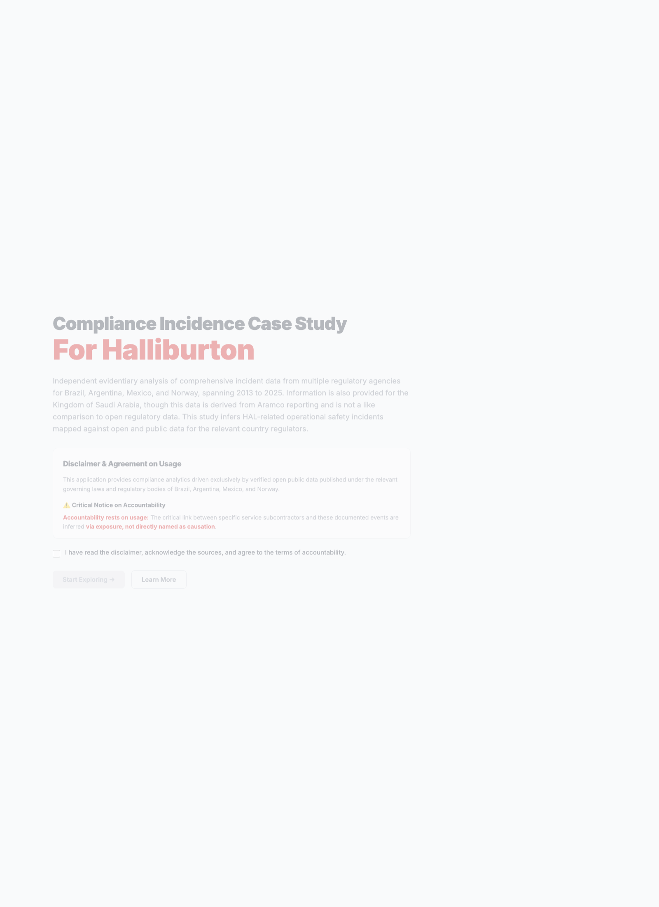
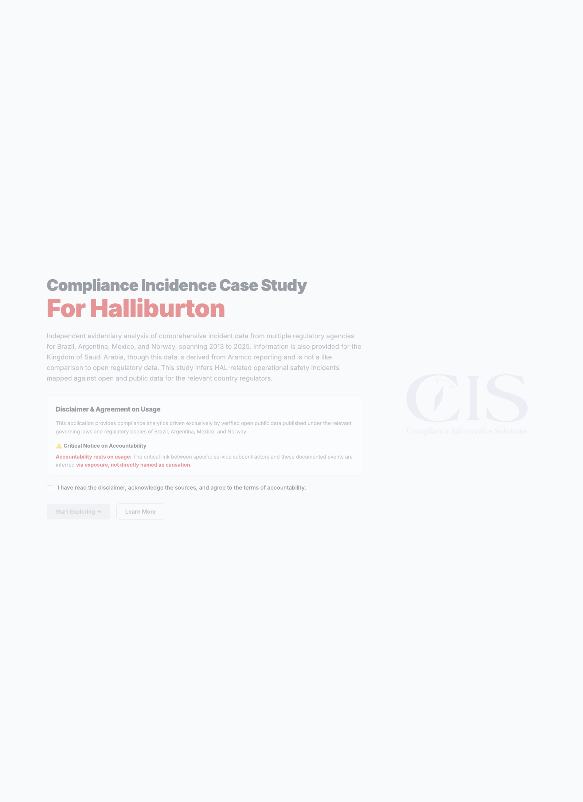

# HAL Tejas Study README

This is the single, combined reference for the public study package and the dashboard that presents it.

It explains:

- the landing page
- every dashboard tab
- every visible widget
- every static dataset embedded in the front-end source
- what the dynamic tables depend on

The study is built around public or public-derived evidence and a cross-region comparison framework.

## What The Study Is Doing

The app compares Halliburton-related operational exposure across:

- Brazil
- Argentina
- Mexico
- Norway
- Saudi Arabia, as a separate non-like-for-like reference stream

The core idea is:

- group incidents, contracts, and regulatory references into a shared schema
- compare risk patterns across jurisdictions
- show the evidence as charts, tables, and narrative report panels
- avoid claiming direct causation where the data only supports inferred exposure

## Page 1: Landing / Disclaimer Page

The landing page lives in [`public/index.html`](/Users/lucasbayout/Downloads/HAL_Tejas_Bveritas-main/public/index.html).

### Headline

The headline presents the project as a compliance incidence case study for Halliburton.

### Introductory paragraph

The page says the study covers:

- incident data from Brazil, Argentina, Mexico, and Norway
- a 2013 to 2025 span
- Saudi Arabia as an additional reference area using Aramco reporting

### Disclaimer box

The disclaimer says:

- the application uses verified public data
- the analysis is based on regulatory and public disclosures
- any link between subcontractors and events is inferred through exposure
- causation is not directly named by the source data

### Agreement checkbox

The checkbox is a gate to acknowledge:

- the sources
- the disclaimer
- accountability for how the findings are used

### Buttons

- `Start Exploring` stores the acceptance flag and opens the dashboard
- `Learn More` links to a public Brazilian incident dataset page

### Landing screen capture

---

## Dashboard Structure

The dashboard is controlled by [`public/app.js`](/Users/lucasbayout/Downloads/HAL_Tejas_Bveritas-main/public/app.js).

The main sections found in the source are:

- `overview`
- `first-report`
- `argentina-audit`
- `mexico-audit`
- `norway-audit`
- `crossanalysis`
- `argentina-crossanalysis`
- `mexico-crossanalysis`
- `norway-crossanalysis`
- `mexico-registry`
- `norway-registry`

These sections are driven by sidebar navigation and are switched by `switchSection(...)`.

## Overview Tab

This tab is the summary layer.

### KPI cards

The KPI cards show:

- total industry incidents
- CSB barrier element failures
- primary barrier loss / kicks
- moderate + severe events

### Well integrity table

This table calculates yearly well-integrity failures as:

- CSB failure
- kick
- structural failure
- loss of well control

It then compares that total against the overall yearly incident count.

### Overview chart

This is a stacked yearly bar chart of:

- CSB Failure
- Kick (Primary Barrier)
- Structural Failure
- Loss of Well Control
- BOP Failure

### Donut chart

This shows category share across the incident dataset.

### CSB trend chart

This compares:

- CSB failures
- kicks

over time.

### Month pattern chart

This shows month-by-month incident patterning.

### Multi-line chart

This compares multiple categories on the same time axis:

- CSB Failure
- Kick (Primary Barrier)
- Structural Failure
- Loss of Well Control

### Severity chart

This shows:

- SSO
- Minor
- Moderate
- Severe

### Breakdown cards

These cards show totals for:

- CSB failure
- kick
- structural failure
- loss of well control

### High-criticality contracts table

This table shows the top evidence-linked contracts, with:

- contract number
- service domain
- summary description
- period
- value
- linked CSB/evidence label

### Correlation matrix

This matrix crosses:

- failure category
- severity level

### Overview screen capture

---

## First Report Tab

This tab is the narrative report layer.

It is intended to turn the study into a readable executive summary by combining:

- the summary metrics
- selected supporting evidence
- regional context
- conclusions

---

## Argentina Audit Tab

This tab contains the Argentina-specific static study data.

### Annual trend data

| Year | Jobs | Stages | PSI | HP | Lateral | Unconv % | Neuquina % |
|---|---:|---:|---:|---:|---:|---:|---:|
| 2015 | 344 | 1,933 | 8,310 | 17,935 | 176 | 78.8 | 82.6 |
| 2016 | 266 | 2,508 | 8,205 | 18,576 | 570 | 79.7 | 84.2 |
| 2017 | 293 | 3,990 | 8,601 | 17,307 | 861 | 88.4 | 82.6 |
| 2018 | 349 | 5,330 | 8,691 | 17,480 | 1,053 | 89.4 | 84.5 |
| 2019 | 321 | 6,683 | 9,220 | 20,472 | 1,313 | 87.5 | 80.4 |
| 2020 | 118 | 3,232 | 9,901 | 18,119 | 1,582 | 93.2 | 82.2 |
| 2021 | 353 | 10,242 | 10,157 | 23,074 | 1,674 | 91.5 | 85.8 |
| 2022 | 426 | 12,799 | 9,927 | 21,827 | 1,715 | 82.4 | 80.0 |
| 2023 | 420 | 14,210 | 11,078 | 24,337 | 2,048 | 85.7 | 79.3 |
| 2024 | 354 | 17,688 | 11,651 | 32,562 | 2,624 | 98.9 | 95.2 |
| 2025 | 383 | 23,784 | 11,965 | 35,319 | 3,038 | 99.5 | 99.5 |

### Operator exposure data

| Operator | Basin | Jobs | Stages | PSI | Tier |
|---|---|---:|---:|---:|---|
| YPF S.A. | NEUQUINA | 1,765 | 51,760 | 10,940 | HIGH |
| TECPETROL S.A. | NEUQUINA | 272 | 8,601 | 10,250 | HIGH |
| TECPETROL S.A. | GOLFO SAN JORGE | 229 | 566 | 7,048 | MEDIUM |
| COMPAÑÍA GENERAL DE COMBUSTIBLES S.A. | AUSTRAL | 212 | 592 | 3,027 | LOW |
| SHELL ARGENTINA S.A. | NEUQUINA | 147 | 5,284 | 11,672 | HIGH |
| VISTA ENERGY ARGENTINA SAU | NEUQUINA | 132 | 6,350 | 13,163 | HIGH |
| PAMPA ENERGIA S.A. | NEUQUINA | 130 | 3,262 | 8,500 | HIGH |
| PAN AMERICAN ENERGY SL | NEUQUINA | 127 | 4,652 | 11,598 | HIGH |
| TOTAL AUSTRAL S.A. | NEUQUINA | 123 | 3,715 | 10,880 | HIGH |
| PLUSPETROL S.A. | NEUQUINA | 116 | 4,915 | 11,411 | HIGH |
| CAPEX S.A. | NEUQUINA | 103 | 321 | 4,999 | HIGH |
| VISTA OIL & GAS ARGENTINA SAU | NEUQUINA | 62 | 2,930 | 12,322 | HIGH |
| CGC ENERGIA SAU | GOLFO SAN JORGE | 48 | 96 | 5,625 | MEDIUM |
| CHEVRON ARGENTINA S.R.L. | NEUQUINA | 36 | 1,453 | 10,461 | HIGH |
| EXXONMOBIL EXPLORATION ARGENTINA S.R.L. | NEUQUINA | 23 | 1,027 | 13,368 | HIGH |

### Formation risk data

| Formation | Jobs | PSI | Shale % | Hazard |
|---|---:|---:|---:|---|
| vaca muerta | 2,467 | 11,823 | 99.8 | High-pressure frac, H2S, wellhead integrity |
| lajas | 235 | 7,140 | 0 | Tight sand, proppant flowback risk |
| magallanes | 197 | 2,888 | 0 | Conventional workover, well integrity |
| mina el carmen | 183 | 7,133 | 0 | Mature field, aging completion equipment |
| mulichinco | 126 | 5,642 | 0 | Tight sand, stimulation fluid returns |
| los molles | 103 | 5,013 | 6.8 | Deep shale, ultra-high pressure, CO₂ |
| punta rosada | 78 | 10,568 | 0 | Golfo San Jorge mature field ops |
| comodoro rivadavia | 68 | 5,187 | 0 | Oldest Argentine province, heavy WO |
| agrio | 55 | 4,423 | 1.8 | Tight carbonate, acid stimulation |
| cañadon seco | 37 | 6,374 | 0 | Standard oilfield operations |

### Regulatory data

| Regulation | Scope | BR Equivalent | Link |
|---|---|---|---|
| Res. SE 25/2004 — Integridad de Pozos | Environmental study standards for exploration permits and exploitation concessions; primary upstream EIA framework | ANP Res. 46/2016 SGIP | infoleg link in source |
| Decreto 929/2013 — Régimen No Convencional | Investment promotion and regulatory framework for unconventional hydrocarbon exploitation | ANP Res. 43/2007 SGSO | infoleg link in source |
| Ley 24.051 — Residuos Peligrosos | Hazardous waste management: drilling fluids, produced water, chemical additives | CONAMA Res. 430/2011 | infoleg link in source |
| Ley 25.675 — Ley General del Ambiente | Environmental liability for all E&P service operations | Lei 9.605/1998 | infoleg link in source |
| Res. SRT 559/2009 — Seguridad en Perforación | OHS for drilling, completion, and workover personnel | NR-37 (MTE) | argentina.gob.ar/srt |
| Ley Neuquén 899 — Código de Aguas | Water use rights and produced water disposal in Neuquina basin | N/A | argentina.gov link in source |
| Decreto Neuquén 1483/2012 — No Convencional | Provincial norms for unconventional reservoir work | N/A | boficial.neuquen.gov.ar |
| Ley 17.319/1967 — Ley de Hidrocarburos | State ownership, licensing, service company obligations | Lei 9.478/1997 | infoleg link in source |

### What the Argentina tab means

The tab is showing:

- activity growth over time
- the concentration of work in the Neuquina basin
- operator intensity by jobs, stages, and pressure
- formation-specific risk profile
- the legal framework that supports the classification

### Argentina screen capture

---

## Mexico Audit Tab

This tab contains the Mexico-specific static study data.

### Annual trend data

| Year | Jobs | Stages | PSI | HP | Lateral | Offshore % | Burgos % |
|---|---:|---:|---:|---:|---:|---:|---:|
| 2015 | 108 | 3,100 | 10,830 | 29,509 | 2,083 | 58.3 | 18.5 |
| 2016 | 115 | 3,149 | 10,841 | 25,636 | 1,991 | 62.6 | 15.7 |
| 2017 | 102 | 2,800 | 11,398 | 27,037 | 1,932 | 64.7 | 16.7 |
| 2018 | 104 | 2,999 | 11,086 | 28,951 | 2,067 | 64.4 | 10.6 |
| 2019 | 104 | 2,717 | 11,766 | 26,679 | 1,987 | 61.5 | 17.3 |
| 2020 | 124 | 3,117 | 11,543 | 29,555 | 1,943 | 54.8 | 20.2 |
| 2021 | 133 | 3,545 | 10,692 | 28,076 | 1,890 | 56.4 | 15.8 |
| 2022 | 115 | 3,085 | 10,818 | 28,342 | 1,987 | 65.2 | 13.0 |
| 2023 | 118 | 3,077 | 10,795 | 27,945 | 2,061 | 58.5 | 16.9 |
| 2024 | 113 | 2,984 | 11,132 | 27,456 | 1,939 | 59.3 | 15.9 |
| 2025 | 109 | 3,014 | 10,761 | 27,212 | 2,038 | 52.3 | 24.8 |

### Operator exposure data

| Operator | Basin | Jobs | Stages | PSI | Tier |
|---|---|---:|---:|---:|---|
| PEMEX EXPLORACIÓN Y PRODUCCIÓN | SURESTE | 859 | 22,995 | 11,087 | HIGH |
| REPSOL EXPLORACIÓN MÉXICO | SURESTE | 75 | 2,018 | 11,155 | HIGH |
| FIELDWOOD ENERGY | SURESTE | 72 | 1,953 | 10,842 | HIGH |
| HOKCHI ENERGY | SURESTE | 69 | 2,034 | 10,513 | HIGH |
| ENI MÉXICO | SURESTE | 59 | 1,398 | 10,716 | HIGH |
| PETROBAL | SURESTE | 59 | 1,708 | 11,471 | HIGH |
| WINTERSHALL DEA | SURESTE | 52 | 1,481 | 11,197 | HIGH |
| MURPHY SUR | SURESTE | 45 | 1,210 | 11,800 | HIGH |
| BHP BILLITON PETRÓLEO | SURESTE | 38 | 950 | 11,250 | HIGH |
| PAN AMERICAN ENERGY | SURESTE | 34 | 890 | 10,600 | MEDIUM |
| LUKOIL UPSTREAM MÉXICO | SURESTE | 28 | 750 | 11,400 | HIGH |
| CHEIRON HOLDINGS | SURESTE | 22 | 620 | 9,850 | MEDIUM |
| DIAVAZ DEP | BURGOS | 110 | 2,800 | 8,500 | MEDIUM |
| TECPETROL DE MÉXICO | BURGOS | 85 | 2,100 | 7,900 | LOW |
| SERVICIOS MÚLTIPLES DE BURGOS | BURGOS | 65 | 1,500 | 7,200 | LOW |

### Formation risk data

| Formation | Jobs | PSI | Offshore % | Hazard |
|---|---:|---:|---:|---|
| Jurásico Superior | 488 | 11,167 | 57.6 | Deep HPHT / Well control |
| Cretácico | 407 | 10,994 | 63.4 | Naturally fractured carbonates |
| Pimienta | 120 | 11,327 | 58.3 | Deep HPHT / Well control |
| Terciario | 117 | 10,404 | 55.6 | Standard pressure horizons |
| Agua Nueva | 113 | 11,125 | 61.1 | Deep HPHT / Well control |

### Regulatory data

| Regulation | Scope | BR Equivalent | Link |
|---|---|---|---|
| Lineamientos de Perforación y Abandono de Pozos (CNH) | Well integrity, barrier elements, BOP requirements | ANP Res. 46/2016 SGIP | DOF link in source |
| Reglamento de la Ley de Hidrocarburos (DOF) | Comprehensive E&P operational regulation | ANP Res. 43/2007 SGSO | DOF link in source |
| NOM-115-SEMARNAT-2003 | Environmental protection and waste management | CONAMA Res. 430/2011 | DOF link in source |
| Lineamientos de Medición de Hidrocarburos (CNH) | Metering and production accounting | ANP Res. 874/2022 | gob.mx/cnh |
| NOM-138-SEMARNAT/SS-2003 | Soil and subsoil contamination limits | CONAMA Res. 357/2005 | DOF link in source |
| ASEA — Gestión de Integridad de Ductos (DOF 2016) | Pipeline and surface line integrity | ANP Res. 46/2016 | gob.mx/asea |
| Ley de Hidrocarburos Art. 40–43 (DOF 2014) | Accountability chain from operator to service company | Lei 9.478/1997 | DOF link in source |
| NOM-001-SESH-2010 (SENER) | Technical safety standards for hydrocarbon installations | NR-37 (MTE offshore) | DOF link in source |

### Mexico-specific note

The source code says Mexico KPI values are calibrated estimates derived from published CNH statistics and reports. The tab is therefore a modeled summary layer rather than a raw government extract.

---

## Norway Audit Tab

This tab has the Norway study data.

### Incident trend data

| Year | Total | Minor | Moderate | Severe | CSB | Kick | BOP | HC Release | Loss Control | Source |
|---|---:|---:|---:|---:|---:|---:|---:|---:|---:|---|
| 2013 | 148 | 82 | 42 | 24 | 38 | 12 | 8 | 11 | 7 | modelled |
| 2014 | 141 | 79 | 39 | 23 | 35 | 11 | 7 | 10 | 6 | modelled |
| 2015 | 132 | 74 | 36 | 22 | 33 | 10 | 7 | 9 | 6 | modelled |
| 2016 | 119 | 67 | 32 | 20 | 30 | 9 | 6 | 9 | 5 | modelled |
| 2017 | 112 | 63 | 30 | 19 | 28 | 9 | 6 | 8 | 5 | modelled |
| 2018 | 124 | 70 | 33 | 21 | 31 | 10 | 7 | 9 | 6 | modelled |
| 2019 | 130 | 73 | 35 | 22 | 33 | 11 | 7 | 10 | 6 | modelled |
| 2020 | 107 | 60 | 29 | 18 | 27 | 8 | 5 | 7 | 5 | modelled |
| 2021 | 115 | 65 | 31 | 19 | 29 | 9 | 6 | 8 | 5 | modelled |
| 2022 | 118 | 66 | 32 | 20 | 30 | 10 | 6 | 8 | 5 | modelled |
| 2023 | 122 | 68 | 33 | 21 | 31 | 10 | 6 | 8 | 6 | modelled |
| 2024 | 138 | 76 | 38 | 24 | 35 | 12 | 8 | 7 | 6 | RNNP 2024 |
| 2025 | 131 | 85 | 23 | 23 | 32 | 15 | 7 | 5 | 5 | RNNP 2025 |

### Norwegian regulatory data

| Regulation | Authority | Scope | BR Equivalent |
|---|---|---|---|
| Aktivitetsforskriften | Havtil / PSA Norway | Well barrier requirements, drilling and well operations | ANP Res. 46/2016 + 43/2007 |
| Styringsforskriften | Havtil / PSA Norway | Risk management and safety critical elements | ANP Res. 43/2007 |
| NORSOK D-010 rev.5 | Standard Norge | Well barrier elements and acceptance criteria | ANP Res. 46/2016 |
| NORSOK D-001 rev.3 | Standard Norge | Drilling fluid and completion fluid design | ANP Res. 43/2007 |
| Petroleumsloven | Ministry of Energy | State ownership, licensing, liability chain | Lei 9.478/1997 |
| RNNP | Havtil / PSA Norway | Annual risk-level benchmarking | ANP SISO-Incidentes equivalent |
| Rammeforskriften | Havtil / PSA Norway | Overarching HSE framework | NR-37 offshore HSE |
| Sodir Resource Classification | Sodir | Wellbore registry and open data mapping | ANP open data equivalent |

### Norway Halliburton overlap data

| RNNP Category | NORSOK Element | Halliburton Service | Exposure |
|---|---|---|---|
| Cement/casing barrier defect | Primary well barrier - cement plug / casing shoe | Halliburton Cementing Services (NCS) | HIGH |
| Completion barrier failure (DHSV) | Secondary barrier - DHSV / production tubing | Halliburton Completion Tools | HIGH |
| Drilling fluid loss / kick | Primary barrier - hydrostatic pressure column | Baroid Drilling Fluids (Halliburton) | HIGH |
| BOP / annular preventer defect | Well control barrier | Pressure Control / MPD (Halliburton) | MODERATE |
| MWD/LWD sensor barrier gap | Monitoring / detection | Sperry Drilling (Halliburton) | LOW |
| Accidental HC release ≥0.1 kg/s | Process / riser barrier | Completion / Well Services (Halliburton) | MODERATE |
| Structural fatigue / damage | Structural barrier element | Halliburton Engineering Services | LOW |

### Norway tables backed by live data

The Norway section also loads API-backed summaries for:

- top operators
- top fields
- field metadata
- source references

The source file does not store those values inline, so the README can explain the table structure but cannot truthfully list every live row without querying the backend at runtime.

---

## Brazil / Cross-Analysis Contract Layer

The shared contract layer processes records into these domains:

- Cementing
- Stimulation
- Fluids
- Completion
- MPD
- Workover
- Well Construction
- G&G Software
- Other

It also tracks values in USD and applies local currency conversion where required.

### Currency handling

The code defines cached FX rates for:

- BRL
- ARS
- MXN
- NOK

These are displayed as:

- Brazilian Real
- Argentine Peso
- Mexican Peso
- Norwegian Krone

The dashboard converts contract values to USD for comparison.

### Contract table behavior

The contract tables support:

- search
- domain filtering
- minimum value filtering
- pagination
- sort by date or value

### Cross-analysis table meaning

The cross-analysis tab is where contract evidence is compared to exposure windows.

It is meant to show:

- whether a service line overlaps with a risky time period
- whether contracts cluster around high-activity years
- how the same domain appears across regions

---

## Static Dataset: Brazilian Well List

The `POCOS_DATA` array is a static list of active wells and well-related records.

| Name | Operator | Basin | Field | Objective | Rig | Water Depth | Start | Environment |
|---|---|---|---|---|---|---:|---|---|
| 1-AG-1-SE | Carmo | Sergipe | AGUILHADA | Abandono | SONDA CONVENCIONAL 59 |  | 20/04/1966 | TERRA |
| 1-ALV-6D-BA | Alvopetro | Recôncavo | MURUCUTUTU | Completação | RAPID RIG Sonda Conv. Perfuração KM | 0 | 27/07/2014 | TERRA |
| 1-BRSA-1146-RJS | Petrobras | Santos | ATAPU | Restauração | Cerrado | 2266 | 18/12/2012 | MAR |
| 1-BRSA-1404DC-RJS | Petrobras | Campos |  | Perfuração |  | 2979 | 22/12/2025 | MAR |
| 1-BRSA-1405-APS | Petrobras | Foz do Amazonas |  | Perfuração |  | 2887 | 20/10/2025 | MAR |
| 1-LV-2-RN | PetroRecôncavo | Potiguar | LIVRAMENTO | Completação | SONDA CONVENCIONAL 97 | 0 | 25/01/1986 | TERRA |
| 1-MM-1-BA | Petrobras | Recôncavo | RIO DO BU | Restauração |  |  | 25/10/1984 | TERRA |
| 1-PSY-18-BA | Petrosynergy | Recôncavo | TROVOADA | Restauração | SONDA PIONEIRA BRASIL | 0 | 17/02/2010 | TERRA |
| 1-SES-114-SE | Petrobras | Sergipe | GUARICEMA | Abandono | NORTH STAR I | 38 | 04/06/1997 | MAR |
| 3-AR-3-BA | Petrobras | Recôncavo | ARAÇÁS | Restauração | SONDA CONVENCIONAL 34 |  | 28/06/1965 | TERRA |
| 3-BRSA-1039D-BA | 3R Bahia | Recôncavo | CEXIS | Restauração | Terra Invader 350 | 0 | 13/01/2012 | TERRA |
| 3-BRSA-1397-RJS | Petrobras | Campos | MARLIM SUL | Perfuração | DEEPWATER AQUILA | 1179 | 25/12/2024 | MAR |
| 3-BRSA-813-RN | PetroRecôncavo | Potiguar | JUAZEIRO | Completação | SONDA CONVENCIONAL 114 | 0 | 07/03/2010 | TERRA |
| 3-BR-6-RJS | Petrobras | Campos | BARRACUDA | Restauração | PARAGON DPDS1 | 882 | 10/10/1993 | MAR |
| 3-JA-2-AL | Petrosynergy | Alagoas | JEQUIÁ | Restauração | SONDA CONVENCIONAL 41 |  | 20/10/1957 | TERRA |
| 3-ORGM-1D-AL | Origem Alagoas | Alagoas | PILAR | Completação | FAXE-2 | 0 | 16/08/2024 | TERRA |
| 3-ORGM-13D-AL | Origem Alagoas | Alagoas | PILAR | Completação |  | 0 | 16/11/2025 | TERRA |
| 3-ORGM-14D-AL | Origem Alagoas | Alagoas | PILAR | Perfuração |  | 0 | 31/01/2026 | TERRA |
| 3-ORGM-3D-AL (a) | Origem Alagoas | Alagoas | PILAR | Completação | National Oilwell Varco - 750 | 0 | 17/05/2025 | TERRA |
| 3-ORGM-3D-AL (b) | Origem Alagoas | Alagoas | PILAR | Completação | FAXE-2 | 0 | 17/05/2025 | TERRA |
| 3-ORGM-4DP-AL | Origem Alagoas | Alagoas | PILAR | Completação |  | 0 | 20/11/2025 | TERRA |
| 3-RSP-5-BA (a) | PetroRecôncavo | Recôncavo | RIACHO SÃO PEDRO | Completação | SONDA CONVENCIONAL 47 |  | 14/03/1978 | TERRA |
| 3-RSP-5-BA (b) | PetroRecôncavo | Recôncavo | RIACHO SÃO PEDRO | Restauração | SONDA CONVENCIONAL 47 |  | 14/03/1978 | TERRA |
| 3-RSP-6-BA | PetroRecôncavo | Recôncavo | RIACHO SÃO PEDRO | Completação | SONDA CONVENCIONAL 35 |  | 22/10/1979 | TERRA |
| 3-RSP-7-BA | PetroRecôncavo | Recôncavo | RIACHO SÃO PEDRO | Completação | SONDA CONVENCIONAL 35 |  | 24/05/1979 | TERRA |
| 3-STAR-28-RN | PetroRecôncavo | Potiguar | SABIÁ BICO-DE-OSSO | Completação | IMETAME_ENERGIA_01 | 0 | 28/05/2012 | TERRA |
| 3-TM-2-AL | Petrosynergy | Alagoas | TABULEIRO MARTINS | Restauração | SONDA CONVENCIONAL 59 |  | 05/01/1962 | TERRA |
| 3-VR-6-RN | PetroRecôncavo | Potiguar | BREJINHO RN | Restauração | SONDA CONVENCIONAL 82 | 0 | 25/09/1994 | TERRA |
| 4-BRSA-1292D-BA | Petrobras | Recôncavo | ARAÇÁS | Restauração | SONDA CONVENCIONAL 105 |  | 14/01/2015 | TERRA |
| 4-BRSA-1395-SPS | Petrobras | Santos |  | Avaliação | Valaris DS-4 | 1758 | 15/12/2024 | MAR |
| 4-CRT-2-RJS | Petrobras | Campos | CARATINGA | Abandono |  | 998 | 14/06/1994 | MAR |
| 4-MDU-3-BA | Petrobras | Recôncavo | ARAÇÁS | Restauração | SONDA CONVENCIONAL 72 |  | 10/05/1981 | TERRA |
| 4-SMC-19-AL | Origem Alagoas | Alagoas | FURADO | Completação | SONDA CONVENCIONAL 26 | 0 | 15/06/1980 | TERRA |
| 6-BRSA-1138-RN | PetroRecôncavo | Potiguar | RIACHO DA FORQUILHA | Restauração | SAIPEM-2 | 0 | 09/12/2012 | TERRA |

### Brazilian well list meaning

This list is used for the well table and filters.

It shows:

- well identifier
- operator
- basin
- field
- objective
- rig name
- water depth
- start date
- environment

---

## Cross-Analysis Contract Domain Rules

The app classifies contract descriptions into domains using keywords.

### Domain mapping

| Domain | Meaning |
|---|---|
| Cementing | Cement and casing-related work |
| Stimulation | Fracturing, acidizing, stimulation operations |
| Fluids | Drilling fluids, chemicals, mud services |
| Completion | Completion and DHSV-related work |
| MPD | Managed pressure drilling |
| Workover | Intervention, re-entry, repair, operations |
| Well Construction | Drilling and construction services |
| G&G Software | Geological, geophysical, licensing, software-related services |
| Other | Anything not matched by keywords |

### Brazil contract processing

Brazil contracts are normalized into:

- contract number
- domain
- object description
- display value
- raw USD value
- country flag
- date sort values
- linked CSB category
- validation score

### Argentina and Mexico contract processing

Argentina and Mexico tables are stored as region-specific evidence grids and use currency conversion where needed.

### Norway contract processing

Norway contracts are also converted to USD for comparison and support:

- search
- domain filtering
- minimum value thresholds
- pagination

---

## Currency Rates Used In The App

The source code defines these cached rates:

| Country Key | Rate | Symbol | Label | Cache Date |
|---|---:|---|---|---|
| BRZ | 5.1519 | R$ | Brazilian Real (BRL) | Apr 8, 2026 |
| ARG | 1395.10 | ARS | Argentine Peso - BCRA official | Apr 8, 2026 |
| MEX | 17.6632 | MX$ | Mexican Peso (MXN) | Apr 8, 2026 |
| NOR | 9.6427 | kr | Norwegian Krone (NOK) | Apr 8, 2026 |

These values are used for conversion into USD comparisons.

---

## Dynamic Data And What Is Not Fully Inline

Some parts of the dashboard are not fully represented as static arrays in the front-end file because they come from backend API calls.

These include:

- `GET /api/stats`
- `GET /api/hal-incidents`
- `GET /api/hal-contracts`
- `GET /api/mexico-metrics`
- `GET /api/norway-stats`

The README cannot truthfully print every live row from those endpoints without runtime access.

What the code does show is:

- the table structure
- the filters
- the fields used
- the chart types
- the classification logic

So this README is exhaustive for the static, embedded datasets and explanatory for the live ones.

---

## How The Tabs Fit Together

1. The landing page explains the rules of use.
2. The overview tab gives the main incident summary.
3. The first report tab turns the evidence into narrative.
4. The Argentina and Mexico audit tabs show country-specific static study data.
5. The Norway audit tab shows Norwegian incident and regulatory context.
6. The cross-analysis tabs compare contracts, timing, and exposure.
7. The registry tabs provide detailed record browsing.

---

## What To Read First

If you want the clearest path through the study, read in this order:

1. Landing page disclaimer
2. Overview tab
3. Argentina audit tab
4. Mexico audit tab
5. Norway audit tab
6. Cross-analysis tab
7. Registry tabs

---

## Key Interpretation Rules

- The study is comparative, not a direct legal finding.
- The source logic infers exposure and overlap.
- Regulatory references are context, not the claim itself.
- Some values are modeled or calibrated from published totals.
- Some tables are live API-backed and therefore dynamic.

---

## Related Files

- [`public/index.html`](/Users/lucasbayout/Downloads/HAL_Tejas_Bveritas-main/public/index.html)
- [`public/app.js`](/Users/lucasbayout/Downloads/HAL_Tejas_Bveritas-main/public/app.js)
- [`public/styles.css`](/Users/lucasbayout/Downloads/HAL_Tejas_Bveritas-main/public/styles.css)
- [`public-study/findings.md`](/Users/lucasbayout/Downloads/HAL_Tejas_Bveritas-main/public-study/findings.md)
- [`public-study/methodology.md`](/Users/lucasbayout/Downloads/HAL_Tejas_Bveritas-main/public-study/methodology.md)
- [`public-study/limitations.md`](/Users/lucasbayout/Downloads/HAL_Tejas_Bveritas-main/public-study/limitations.md)
- [`public-study/references.md`](/Users/lucasbayout/Downloads/HAL_Tejas_Bveritas-main/public-study/references.md)
